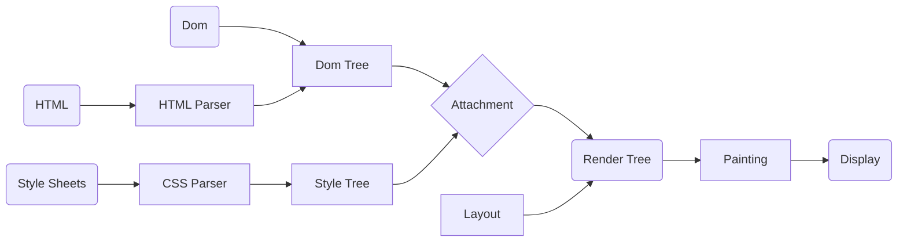
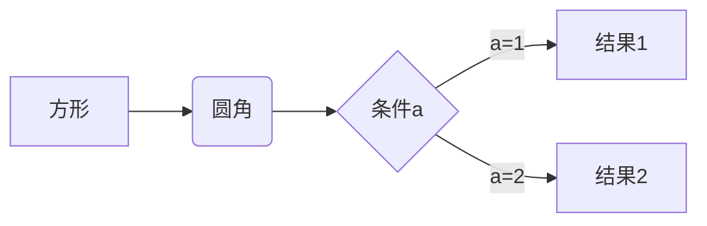
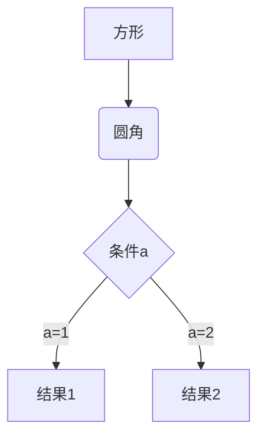
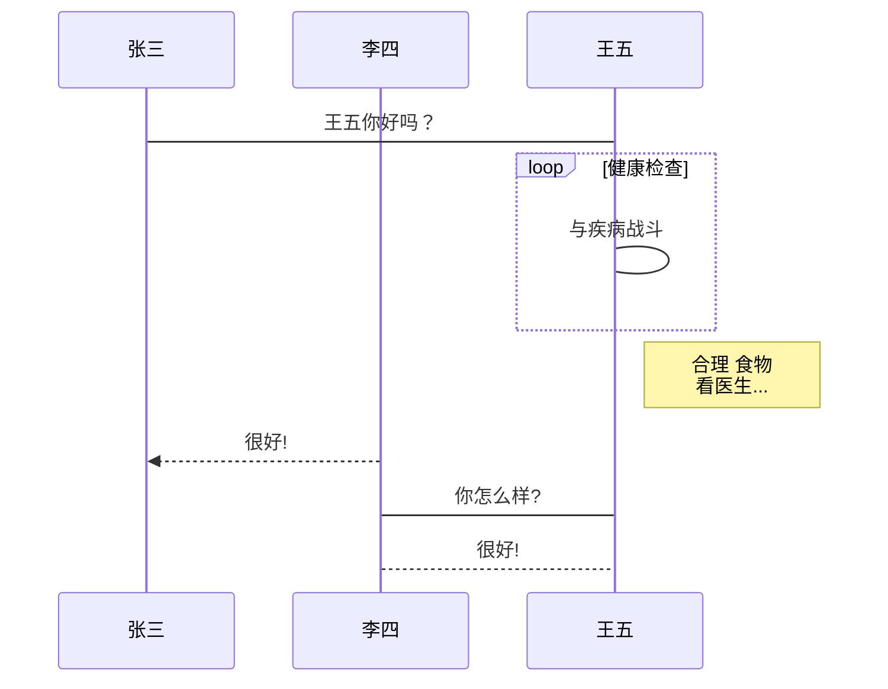
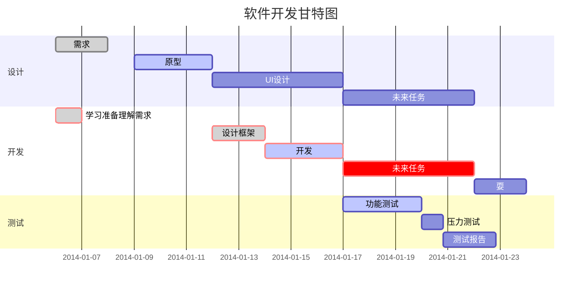
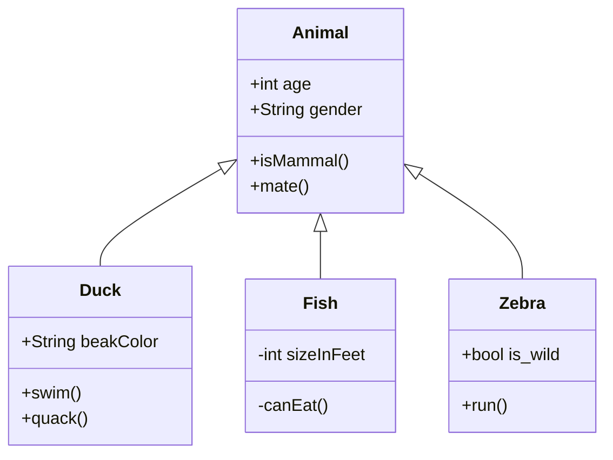
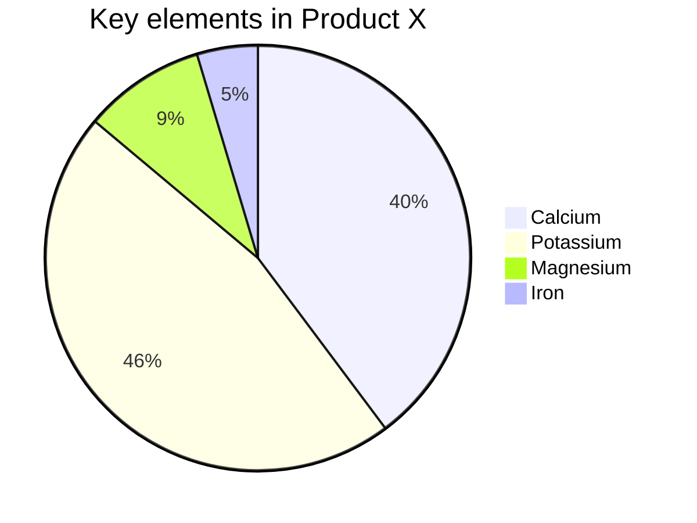

# study record

## git


### 分支操作

1. 创建分支
    `git branch "Branch Name"`
  - 查看所有分支记录
    `git branch -a`
  - 删除分支
    `git branch -D "Branch Name"`
  - 删除远程连接分支
    `git push origin --delete "Branch Name"`
2. 切换分支
    `git checkout "Branch Name"`
3. 上传
  - 单独上传 切换到需要上传的分支进行上传
  - 合并上传
    - 合并分支 需切换到主分支
    `git merge "Branch Name"`
    - 合并分支 增加日志
    `git merge "Branch Name" -m "log Name`


### 日常使用

1. 创建仓库
2. Git Bash Here
  - 创建本地仓库
    `git init`
3. 添加文件至暂存区
    `git add <fliename>`
    `git add .`
  - 查看暂存区状态 项目提交仓库后无法查看
    `git status`
4. 配置本地仓库
    `git config --global user.email "you@example.com"`
    `git config --global user.name "Your Name"`
5. 创建项目至本地仓库
    `git commit -m "log name"`
  - 查看日志列表
    `git log`
6. 项目更新/拉取远程代码合并
    `git pull`
    `git pull --rebase origin master`
  - 克隆项目
    `git clone "Project Address"`
7. 本地仓库同步至远程服务器
  - 连接远程
    `git remote add origin "Remote Address"`
  - 删除之前的远程仓库链接
    `git remote rm origin`
  - 上传项目
    `git push -u origin master`
  - 强制提交 会覆盖远程文件
    `git push -f origin master`


### 项目版本

1. 查看当前版本

   `git show`

2. 回到上个版本 

   `git reset --hard HEAD^`

3. 查看所有版本号

   `git reflog`

4. 回退到指定版本

   `git reset --hard "reflog vesion"`


### 其他命令

1. 查看当前文件与暂存区文件区别
    `git diff`
2. 回撤所有文件
  - 如果已经向暂存区添加了项目，必须先回撤在撤销
    `git checkout --.`
  - 回撤add 取消暂存区文件
    `git reset HEAD.`
  - 回撤指定文件到上一个版本
    `git checkout --"fileName"`
3. 生成SSH密钥
    `ssh-keygen -t rsa -C "you@example.com"`
4. 查看密钥
    ```cat ~/.ssh/id_rsa.pub```
5. .gitignore文件 限制上传文件/文件夹


## javascript


### 递归思路

```js
const arr = [1, 2, 3, 4, 5, 6, 7, 8, 9, 10]

function sum (list, i = 0) {
  if (i === list.length) return 0
  return list[i] + sum(list, i+1)
}

console.log('sum', sum(arr)); // 55
```


### 斐波那契

```js
// Todo: 斐波那契 [1，1，2，3，5，8，13，21，34，55，89]
class Fibonacci {
  first (i) {
    if (i < 2) return 1
    const arr = [1, 1]
    for (let j = 2; j <= i; j++) {
      arr[j] = arr[j - 1] + arr[j - 2]
    }

    return arr[i]
  }

  two (i) {
    if (i < 2) return 1
    let num1 = 1, num2 = 1, num3
    for (let j = 2; j <= i; j++) {
      num3 = num1 + num2
      num1 = num2
      num2 = num3
    }

    return num3
  }
}

console.log(new Fibonacci().first(9)); // On ==> 55
console.log(new Fibonacci().two(9)); // O1 ==> 55
```


### class to function

```js
// class
class ModeDom {
  constructor (name) {
    this.name = name
  }

  func () {
    console.log(this.name);
  }
}

// Todo: Class constructor ModeDom cannot be invoked without 'new'
// ModeDom('abc')

// Todo: key only name
// const e = new ModeDom('abc')
// for (const key in e) {
//   console.log(key);
// }

// Todo: e.func is not a constructor
// const e = new ModeDom('abc')
// new e.func()
```

```js
'use strict';

function ModeDom (name) {
  // Todo: 验证this指向
  if (!(this instanceof ModeDom)) {
    throw new TypeError(`Class constructor ModeDom cannot be invoked without 'new'`)
  }
  this.name = name
}

Object.defineProperty(ModeDom.prototype, 'func', {
  value: () => {
    // Todo: 验证this指向, 不可被new调用
    if (!(this instanceof ModeDom)) {
      throw new TypeError(`Class constructor ModeDom cannot be invoked without 'new'`)
    }
    console.log(this.name);
  },
  enumerable: false /// Todo: 不可被枚举
})
// ModeDom.prototype.func = () => {
//   console.log(this.name);
// }

// Todo: Class constructor ModeDom cannot be invoked without 'new'
// ModeDom('abc')

// Todo: key only name
// const e = new ModeDom('abc')
// for (const key in e) {
//   console.log(key);
// }

// Todo: e.func is not a constructor
// const e = new ModeDom('abc')
// new e.func()
```


## 具体优化


### html滚动优化

> Pc端

```css
/* 禁止在页面滚动时鼠标频繁触发事件 */
body {
  pointer-events: none;
}
```

```javascript
let timer = null

window.addEventListener("scroll", function () {
  // 滚动时禁用鼠标事件
  document.body.style.pointerEvents = 'none';
  if (timer) { clearTimeout(timer) }
  timer = setTimeout(() => {
    // 释放
    document.body.style.pointerEvents = 'auto';
  }, 100);
})
```

> 移动端

```css
/* 阻止原生touch事件只允许进行滚动和持续缩放操作 */
html {
  touch-action: manipulation;
}
```

```js
// 在需要时主动触发对全局的手势禁用
document.documentElement.style.touchAction = 'none'
// 或者独立禁用某一片区域的手势操作
document.getElementById('xxx').style.touchAction = 'none'
// 不需要时还原，例如在抬手事件中处理
document.addEventListener('touchend', function (event) {
  // 或 auto
  document.documentElement.style.touchAction = 'manipulation'
});
```


## 奇思妙想

### `1:1` 透明图片

```html

```


## 同源 & 跨域

### 常见的跨域场景

1. 同一域名，不同端口
2. 同一域名，不同协议（http、https）
3. 域名和域名对应的IP
4. 主域相同，子域不同
5. 同一域名，不同二级域名
6. 不同域名

**注意**

- 协议和端口造成的跨域问题，前台是无能为力的
- 在跨域问题上，仅仅通过“URL”的首部来识别而不会根据域名对应的IP地址是否相同来判断
- 跨域不是请求发不出去，而是浏览器把请求回来的数据拦截了


### 跨域同源

>  同源策略是浏览器最核心也是最基本的安全策略。如果缺少同源策略，浏览器会很容易受到XSS、CSFR等攻击。所谓同源，指`协议`、`域名`、`端口`三者相同，其中有一个不同就是不同源。

**注意：下面几种情况不受同源策略限制**

1. 页面中的链接（例如页面中的a标签链接）
2. 重定向
3. 表单提交
4. 跨域资源的引入，但是js读不到其中的资源（script标签、img标签、link标签、iframe标签）

> 同源策略限制的内容
>
> 1. Cookie、LocalStorage、IndexDB等存储内容
> 2. DOM节点
> 3. AJAX请求拦截


### CORS

- CORS需要浏览器和后断同时支持，IE8、IE9需要通过XDomainRequest来实现。

- 浏览器会自动进行CORS，只要后端实现了CORS，就实现了跨域

- 服务端设置Access-Control-Allow-Origin


### JSONP

> 利用`scipt`标签没有跨域限制的漏洞，网页可以得到从其他来源动态生产的JSON数据

**JSONP 请求一定需要对方的服务器支持**

- AJAX属于同源策略，与JSONP相反

- JSONP兼容性好，但仅支持GET方法，具有局限性

```js
function jsonp({ url, params, callback }) {
  return new Promise((resolve, reject) => {
    let script = document.createElement("script");
    window[callback] = function (data) {
      resolve(data);
      document.body.removeChild(script);
    }
    params = [...params, callback];
    let arrs = [];
    for(let key in params) {
      arrs.push(`${key}=${params[key]}`);
    }
    script.src = `${url}?${arrs.join("&")}`;
    document.body.appendChild(script);
  })
}
```

> Jquery的JSONP
>
> 在使用Jquery发送AJAX时， 设置 `dataType: jsonp`


### nginx 反向代理

> 实现原理类似于Node中间件代理，需要搭建一个nginx反向代理服务器，用于转发请求。支持所有的浏览器，支持session。


### node 中间件代理

1. 接收客户端请求
2. 将请求发送服务器
3. 拿到服务器响应数据
4. 将数据返回给客户端


### postMessage

> H5中XMLHttpLevel2中的API，可以跨域操作的window属性之一
>
> postMessage方法允许来自不同源的脚本采用异步方式进行有限的通讯，可以实现跨文本文档，多窗口，跨域传递信息

1. 页面和其他打开的新窗口的数据传输
2. 多窗口之间的信息传递
3. 页面与嵌套的iframe的消息传递
4. 上面三个场景的跨域数据传递

```javascript
otherWindow.postMessage(message, targetOrigin, [transfer])
```

- message：要发送到其他window的数据
- targetOrigin：通过origin属性来指定那些窗口能够接收消息事件，其值为字符串`*`表示无限制，如果目标窗口的协议、主机地址或者端口号有任意不匹配，就不会发送消息
- transfer（可选）：Transferable对象，这些对象的所有权被转移给消息的接收方，发送方不保留所有权

```html
<!-- a.html -->
<iframe src="http://localhost:400/b.html" frameborder="0" id="iframe" onload="load()"></iframe>
<script>
  function load() {
    let frame = document.getElementById("iframe");
    frame.contentWindow.postMessage("iloveyou", "http://localhost:400");
    window.onmessage = function (e){
      console.log(e.data); //no
    }
  }
</script>

<!-- b.html -->
<script>
  window.onmessage = function(e) {
    console.log(e.data); // iloveyou
  }
  e.source.postMessage("no", e.origin)
</script>
```


### websocket

> websocket是h5的一个持久化协议，实现了浏览器与服务器的全双工通信，其与HTTP都基于TCP协议
>
> websocket是一种双向通信协议，在建立连接之后，websocket的server与client都能主动向对方发送或接收数据


### window.name + iframe

> window.name属性值在不同的页面（甚至不同的域名）加载后依旧存在，并且可以支持非常的时间，大小为2MB。
>
> 类似的还有 location+hash+iframe、document.domain+iframe


## 面试理论

### 浏览器渲染机制

<table border="1">
  <thead>
    <tr>
      <th colspan="3">浏览器</th>
    </tr>
  </thead>
	<tr>
    <td rowspan="9">浏览器进程</td>
    <td>主进程(Browser Process)</td>
    <td>负责浏览器界面的显示与交互。各个页面的管理,创建和销毁其他进程。网络的资源管理、下载等。</td>
	</tr>
  <tr>
    <td>第三方插件进程(Plugin Process)</td>
    <td>每种类型的插件对应一个进程,仅当使用该插件时才创建。</td>
  </tr>
  <tr>
    <td>GPU进程(GPU Process)</td>
    <td>最多只有一个,用于 3D 绘制等</td>
  </tr>
  <tr>
    <td rowspan="6">渲染进程(Renderer Process)</td>
    <td>称为浏览器渲染进程或浏览器内核,内部是多线程的。主要负责页面渲染,脚本执行,事件处理等。 </td>
  </tr>
  <tr>
    <td>
      <code>JS引擎线程</code>
    </td>
  </tr>
  <tr>
    <td>
      <code>事件触发线程</code>
    </td>
  </tr>
  <tr>
    <td>
      <code>定时触发器线程</code>
    </td>
  </tr>
  <tr>
    <td>
      <code>异步http请求线程</code>
    </td>
  </tr>
  <tr>
    <td>
      <code>GUI渲染线程</code>
    </td>
  </tr>
</table>


> 浏览器渲染流程
>
> 1. 解析 HTML 文件,构建 DOM 树,同时浏览器主进程负责下载 CSS 文件
> 2. CSS 文件下载完成,解析 CSS 文件成树形的数据结构,然后结合 DOM 树合并成 RenderObject 树
> 3. 布局 RenderObject 树 （Layout/reflow）,负责 RenderObject 树中的元素的尺寸,位置等计算
> 4. 绘制 RenderObject 树 （paint）,绘制页面的像素信息
> 5. 浏览器主进程将默认的图层和复合图层交给 GPU 进程,GPU 进程再将各个图层合成（composite）,最后显示出页面



[](https://mermaid-js.github.io/mermaid-live-editor/edit#pako:eNpNkU-LgzAQxb9KmJMFW7SJbuthoa39c7BsqT2t9hDqtAoaJUZYV_zuq5Fd9vbLey9vYKaDR5kgePCSvEpJcI1FrDbG6XYOZmQ-fyfbaGRy4bJGeR9d3_DLYjJ30YDkJhG1s53EEXca991GKf5ICxSqH-XQCFWbIwlTRFVPJYdoF4b_Bxy0fIym6F_7caocca_xZFxRJCh1ZDbqQRTwtmzUffJH6aTxEl14JlQmXrrqosUPw8_qKuftDEwoUBY8S4ZNdLEgJAaVYoExeAMm-ORNrmKIRT9EeaPKsBUP8JRs0ISmSrhCP-PDDgvwnjyvB7Xi4rMsi9_Q8ASvgy_wbNta2GxpUWdN6WrpOia04FHmLGzXpsxyV2-Ww1hvwrf-by2GEGMus-l6TVfUYSZgkqlSnqfT6Qv2PxHajMM)


## Markdown 高级语法

### 书写一个质能守恒公式[^LaTeX]

$$E=mc^2$$


### 画一个图

#### 横向流程图源码样例


#### 竖向流程图源码样例


#### 标准流程图源码样例

```flow
st=>start: Start
op=>operation: Your Operation
cond=>condition: Yes or No?
e=>end
st->op->cond
cond(yes)->e
cond(no)->op
st=>start: 开始框
op=>operation: 处理框
cond=>condition: 判断框(是或否?)
sub1=>subroutine: 子流程
io=>inputoutput: 输入输出框
e=>end: 结束框
st->op->cond
cond(yes)->io->e
cond(no)->sub1(right)->op
```

#### 标准流程图源码样例（横向）

```flow
st=>start: 开始框
op=>operation: 处理框
cond=>condition: 判断框(是或否?)
sub1=>subroutine: 子流程
io=>inputoutput: 输入输出框
e=>end: 结束框
st(right)->op(right)->cond
cond(yes)->io(bottom)->e
cond(no)->sub1(right)->op
```
#### UML时序图源码样例

```sequence
对象A->对象B: 对象B你好吗?（请求）
Note right of 对象B: 对象B的描述
Note left of 对象A: 对象A的描述(提示)
对象B-->对象A: 我很好(响应)
对象A->对象B: 你真的好吗？
```
#### UML时序图源码复杂样例

```sequence
Title: 标题：复杂使用
对象A->对象B: 对象B你好吗?（请求）
Note right of 对象B: 对象B的描述
Note left of 对象A: 对象A的描述(提示)
对象B-->对象A: 我很好(响应)
对象B->小三: 你好吗
小三-->>对象A: 对象B找我了
对象A->对象B: 你真的好吗？
Note over 小三,对象B: 我们是朋友
participant C
Note right of C: 没人陪我玩
```
#### UML标准时序图样例


#### 甘特图样例



#### 类图样例



#### 饼图样例




[^LaTeX]: 支持 **LaTeX** 编辑显示支持，例如：$\sum_{i=1}^n a_i=0$， 访问 [MathJax][4] 参考更多使用方法。