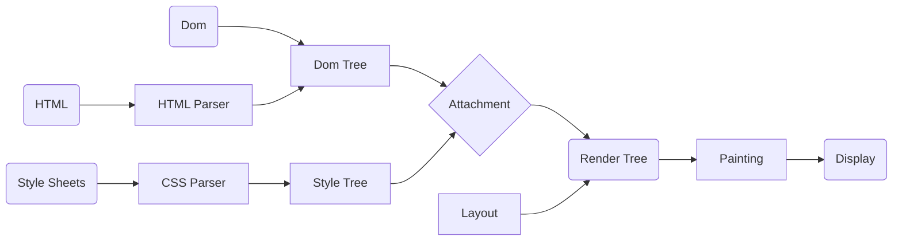
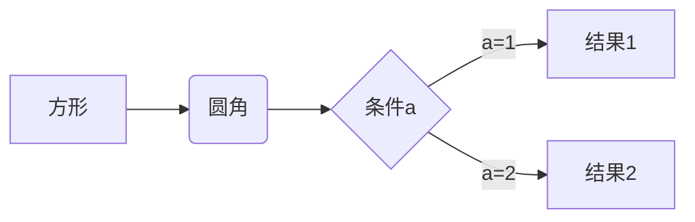
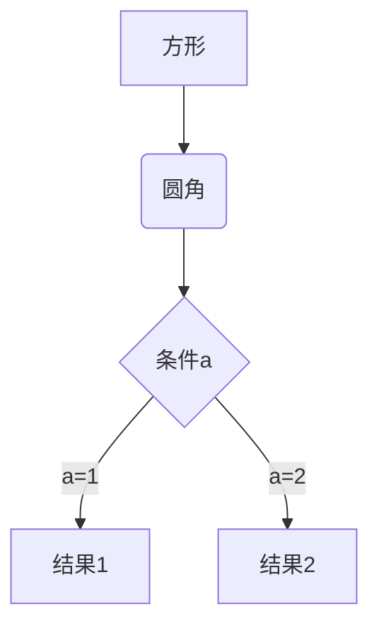
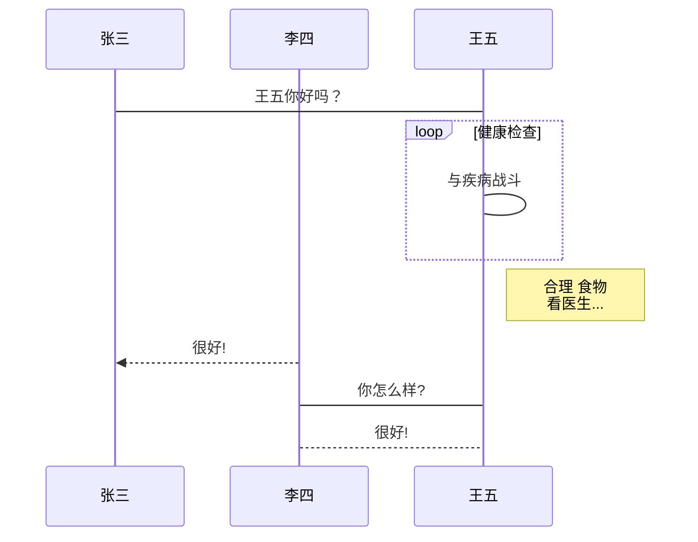
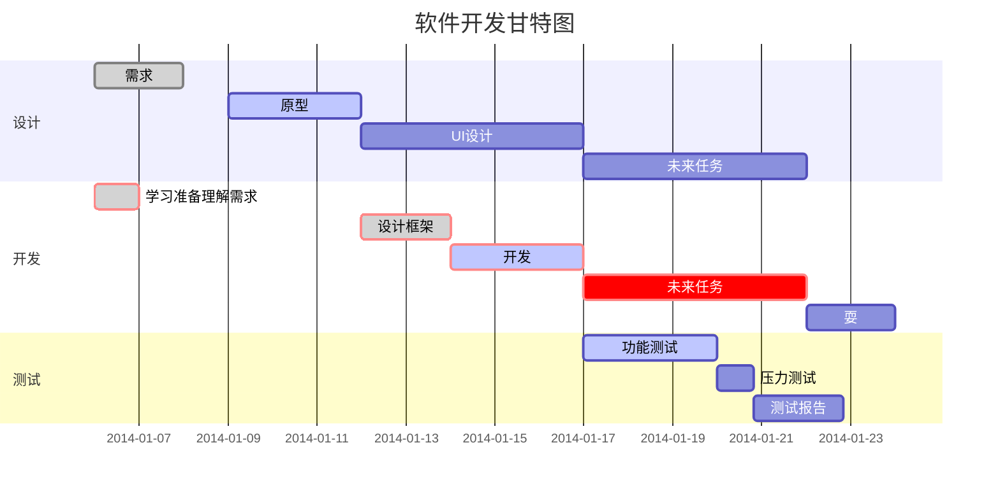
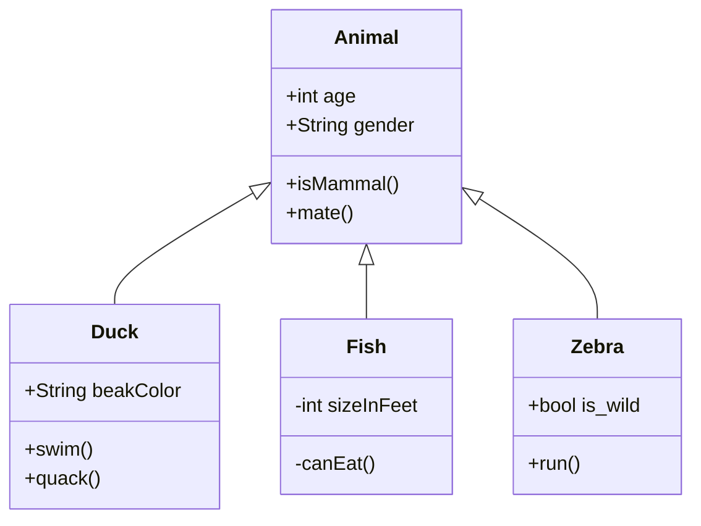
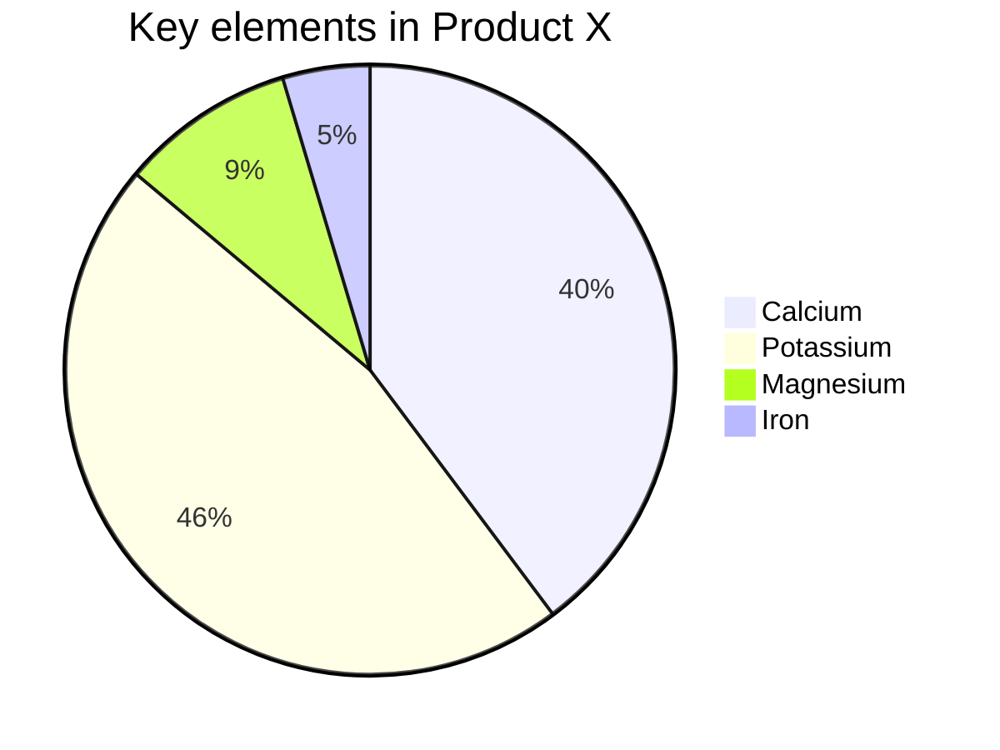

# study record

## git


### 分支操作

1. 创建分支
    `git branch "Branch Name"`
  - 查看所有分支记录
    `git branch -a`
  - 删除分支
    `git branch -D "Branch Name"`
  - 删除远程连接分支
    `git push origin --delete "Branch Name"`
2. 切换分支
    `git checkout "Branch Name"`
3. 上传
  - 单独上传 切换到需要上传的分支进行上传
  - 合并上传
    - 合并分支 需切换到主分支
    `git merge "Branch Name"`
    - 合并分支 增加日志
    `git merge "Branch Name" -m "log Name`


### 日常使用

1. 创建仓库
2. Git Bash Here
  - 创建本地仓库
    `git init`
3. 添加文件至暂存区
    `git add <fliename>`
    `git add .`
  - 查看暂存区状态 项目提交仓库后无法查看
    `git status`
4. 配置本地仓库
    `git config --global user.email "you@example.com"`
    `git config --global user.name "Your Name"`
5. 创建项目至本地仓库
    `git commit -m "log name"`
  - 查看日志列表
    `git log`
6. 项目更新/拉取远程代码合并
    `git pull`
    `git pull --rebase origin master`
  - 克隆项目
    `git clone "Project Address"`
7. 本地仓库同步至远程服务器
  - 连接远程
    `git remote add origin "Remote Address"`
  - 删除之前的远程仓库链接
    `git remote rm origin`
  - 上传项目
    `git push -u origin master`
  - 强制提交 会覆盖远程文件
    `git push -f origin master`


### 项目版本

1. 查看当前版本

   `git show`

2. 回到上个版本 

   `git reset --hard HEAD^`

3. 查看所有版本号

   `git reflog`

4. 回退到指定版本

   `git reset --hard "reflog vesion"`


### 其他命令

1. 查看当前文件与暂存区文件区别
    `git diff`
2. 回撤所有文件
  - 如果已经向暂存区添加了项目，必须先回撤在撤销
    `git checkout --.`
  - 回撤add 取消暂存区文件
    `git reset HEAD.`
  - 回撤指定文件到上一个版本
    `git checkout --"fileName"`
3. 生成SSH密钥
    `ssh-keygen -t rsa -C "you@example.com"`
4. 查看密钥
    ```cat ~/.ssh/id_rsa.pub```
5. .gitignore文件 限制上传文件/文件夹


## javascript


### 递归思路

```js
const arr = [1, 2, 3, 4, 5, 6, 7, 8, 9, 10]

function sum (list, i = 0) {
  if (i === list.length) return 0
  return list[i] + sum(list, i+1)
}

console.log('sum', sum(arr)); // 55
```


### 斐波那契

```js
// Todo: 斐波那契 [1，1，2，3，5，8，13，21，34，55，89]
class Fibonacci {
  first (i) {
    if (i < 2) return 1
    const arr = [1, 1]
    for (let j = 2; j <= i; j++) {
      arr[j] = arr[j - 1] + arr[j - 2]
    }

    return arr[i]
  }

  two (i) {
    if (i < 2) return 1
    let num1 = 1, num2 = 1, num3
    for (let j = 2; j <= i; j++) {
      num3 = num1 + num2
      num1 = num2
      num2 = num3
    }

    return num3
  }
}

console.log(new Fibonacci().first(9)); // On ==> 55
console.log(new Fibonacci().two(9)); // O1 ==> 55
```


### class to function

```js
// class
class ModeDom {
  constructor (name) {
    this.name = name
  }

  func () {
    console.log(this.name);
  }
}

// Todo: Class constructor ModeDom cannot be invoked without 'new'
// ModeDom('abc')

// Todo: key only name
// const e = new ModeDom('abc')
// for (const key in e) {
//   console.log(key);
// }

// Todo: e.func is not a constructor
// const e = new ModeDom('abc')
// new e.func()
```

```js
'use strict';

function ModeDom (name) {
  // Todo: 验证this指向
  if (!(this instanceof ModeDom)) {
    throw new TypeError(`Class constructor ModeDom cannot be invoked without 'new'`)
  }
  this.name = name
}

Object.defineProperty(ModeDom.prototype, 'func', {
  value: () => {
    // Todo: 验证this指向, 不可被new调用
    if (!(this instanceof ModeDom)) {
      throw new TypeError(`Class constructor ModeDom cannot be invoked without 'new'`)
    }
    console.log(this.name);
  },
  enumerable: false /// Todo: 不可被枚举
})
// ModeDom.prototype.func = () => {
//   console.log(this.name);
// }

// Todo: Class constructor ModeDom cannot be invoked without 'new'
// ModeDom('abc')

// Todo: key only name
// const e = new ModeDom('abc')
// for (const key in e) {
//   console.log(key);
// }

// Todo: e.func is not a constructor
// const e = new ModeDom('abc')
// new e.func()
```


## 具体优化


### html滚动优化

> Pc端

```css
/* 禁止在页面滚动时鼠标频繁触发事件 */
body {
  pointer-events: none;
}
```

```javascript
let timer = null

window.addEventListener("scroll", function () {
  // 滚动时禁用鼠标事件
  document.body.style.pointerEvents = 'none';
  if (timer) { clearTimeout(timer) }
  timer = setTimeout(() => {
    // 释放
    document.body.style.pointerEvents = 'auto';
  }, 100);
})
```

> 移动端

```css
/* 阻止原生touch事件只允许进行滚动和持续缩放操作 */
html {
  touch-action: manipulation;
}
```

```js
// 在需要时主动触发对全局的手势禁用
document.documentElement.style.touchAction = 'none'
// 或者独立禁用某一片区域的手势操作
document.getElementById('xxx').style.touchAction = 'none'
// 不需要时还原，例如在抬手事件中处理
document.addEventListener('touchend', function (event) {
  // 或 auto
  document.documentElement.style.touchAction = 'manipulation'
});
```


## 奇思妙想

### `1:1` 透明图片

```html

```


## 同源 & 跨域

### 常见的跨域场景

1. 同一域名，不同端口
2. 同一域名，不同协议（http、https）
3. 域名和域名对应的IP
4. 主域相同，子域不同
5. 同一域名，不同二级域名
6. 不同域名

**注意**

- 协议和端口造成的跨域问题，前台是无能为力的
- 在跨域问题上，仅仅通过“URL”的首部来识别而不会根据域名对应的IP地址是否相同来判断
- 跨域不是请求发不出去，而是浏览器把请求回来的数据拦截了


### 跨域同源

>  同源策略是浏览器最核心也是最基本的安全策略。如果缺少同源策略，浏览器会很容易受到XSS、CSFR等攻击。所谓同源，指`协议`、`域名`、`端口`三者相同，其中有一个不同就是不同源。

**注意：下面几种情况不受同源策略限制**

1. 页面中的链接（例如页面中的a标签链接）
2. 重定向
3. 表单提交
4. 跨域资源的引入，但是js读不到其中的资源（script标签、img标签、link标签、iframe标签）

> 同源策略限制的内容
>
> 1. Cookie、LocalStorage、IndexDB等存储内容
> 2. DOM节点
> 3. AJAX请求拦截


### CORS

- CORS需要浏览器和后断同时支持，IE8、IE9需要通过XDomainRequest来实现。

- 浏览器会自动进行CORS，只要后端实现了CORS，就实现了跨域

- 服务端设置Access-Control-Allow-Origin


### JSONP

> 利用`scipt`标签没有跨域限制的漏洞，网页可以得到从其他来源动态生产的JSON数据

**JSONP 请求一定需要对方的服务器支持**

- AJAX属于同源策略，与JSONP相反

- JSONP兼容性好，但仅支持GET方法，具有局限性

```js
function jsonp({ url, params, callback }) {
  return new Promise((resolve, reject) => {
    let script = document.createElement("script");
    window[callback] = function (data) {
      resolve(data);
      document.body.removeChild(script);
    }
    params = [...params, callback];
    let arrs = [];
    for(let key in params) {
      arrs.push(`${key}=${params[key]}`);
    }
    script.src = `${url}?${arrs.join("&")}`;
    document.body.appendChild(script);
  })
}
```

> Jquery的JSONP
>
> 在使用Jquery发送AJAX时， 设置 `dataType: jsonp`


### nginx 反向代理

> 实现原理类似于Node中间件代理，需要搭建一个nginx反向代理服务器，用于转发请求。支持所有的浏览器，支持session。


### node 中间件代理

1. 接收客户端请求
2. 将请求发送服务器
3. 拿到服务器响应数据
4. 将数据返回给客户端


### postMessage

> H5中XMLHttpLevel2中的API，可以跨域操作的window属性之一
>
> postMessage方法允许来自不同源的脚本采用异步方式进行有限的通讯，可以实现跨文本文档，多窗口，跨域传递信息

1. 页面和其他打开的新窗口的数据传输
2. 多窗口之间的信息传递
3. 页面与嵌套的iframe的消息传递
4. 上面三个场景的跨域数据传递

```javascript
otherWindow.postMessage(message, targetOrigin, [transfer])
```

- message：要发送到其他window的数据
- targetOrigin：通过origin属性来指定那些窗口能够接收消息事件，其值为字符串`*`表示无限制，如果目标窗口的协议、主机地址或者端口号有任意不匹配，就不会发送消息
- transfer（可选）：Transferable对象，这些对象的所有权被转移给消息的接收方，发送方不保留所有权

```html
<!-- a.html -->
<iframe src="http://localhost:400/b.html" frameborder="0" id="iframe" onload="load()"></iframe>
<script>
  function load() {
    let frame = document.getElementById("iframe");
    frame.contentWindow.postMessage("iloveyou", "http://localhost:400");
    window.onmessage = function (e){
      console.log(e.data); //no
    }
  }
</script>

<!-- b.html -->
<script>
  window.onmessage = function(e) {
    console.log(e.data); // iloveyou
  }
  e.source.postMessage("no", e.origin)
</script>
```


### websocket

> websocket是h5的一个持久化协议，实现了浏览器与服务器的全双工通信，其与HTTP都基于TCP协议
>
> websocket是一种双向通信协议，在建立连接之后，websocket的server与client都能主动向对方发送或接收数据


### window.name + iframe

> window.name属性值在不同的页面（甚至不同的域名）加载后依旧存在，并且可以支持非常的时间，大小为2MB。
>
> 类似的还有 location+hash+iframe、document.domain+iframe


## 面试理论

### 浏览器渲染机制

<table border="1">
  <thead>
    <tr>
      <th colspan="3">浏览器</th>
    </tr>
  </thead>
	<tr>
    <td rowspan="9">浏览器进程</td>
    <td>主进程(Browser Process)</td>
    <td>负责浏览器界面的显示与交互。各个页面的管理,创建和销毁其他进程。网络的资源管理、下载等。</td>
	</tr>
  <tr>
    <td>第三方插件进程(Plugin Process)</td>
    <td>每种类型的插件对应一个进程,仅当使用该插件时才创建。</td>
  </tr>
  <tr>
    <td>GPU进程(GPU Process)</td>
    <td>最多只有一个,用于 3D 绘制等</td>
  </tr>
  <tr>
    <td rowspan="6">渲染进程(Renderer Process)</td>
    <td>称为浏览器渲染进程或浏览器内核,内部是多线程的。主要负责页面渲染,脚本执行,事件处理等。 </td>
  </tr>
  <tr>
    <td>
      <code>JS引擎线程</code>
    </td>
  </tr>
  <tr>
    <td>
      <code>事件触发线程</code>
    </td>
  </tr>
  <tr>
    <td>
      <code>定时触发器线程</code>
    </td>
  </tr>
  <tr>
    <td>
      <code>异步http请求线程</code>
    </td>
  </tr>
  <tr>
    <td>
      <code>GUI渲染线程</code>
    </td>
  </tr>
</table>


> 浏览器渲染流程
>
> 1. 解析 HTML 文件,构建 DOM 树,同时浏览器主进程负责下载 CSS 文件
> 2. CSS 文件下载完成,解析 CSS 文件成树形的数据结构,然后结合 DOM 树合并成 RenderObject 树
> 3. 布局 RenderObject 树 （Layout/reflow）,负责 RenderObject 树中的元素的尺寸,位置等计算
> 4. 绘制 RenderObject 树 （paint）,绘制页面的像素信息
> 5. 浏览器主进程将默认的图层和复合图层交给 GPU 进程,GPU 进程再将各个图层合成（composite）,最后显示出页面



[](https://mermaid-js.github.io/mermaid-live-editor/edit#pako:eNpNkU-LgzAQxb9KmJMFW7SJbuthoa39c7BsqT2t9hDqtAoaJUZYV_zuq5Fd9vbLey9vYKaDR5kgePCSvEpJcI1FrDbG6XYOZmQ-fyfbaGRy4bJGeR9d3_DLYjJ30YDkJhG1s53EEXca991GKf5ICxSqH-XQCFWbIwlTRFVPJYdoF4b_Bxy0fIym6F_7caocca_xZFxRJCh1ZDbqQRTwtmzUffJH6aTxEl14JlQmXrrqosUPw8_qKuftDEwoUBY8S4ZNdLEgJAaVYoExeAMm-ORNrmKIRT9EeaPKsBUP8JRs0ISmSrhCP-PDDgvwnjyvB7Xi4rMsi9_Q8ASvgy_wbNta2GxpUWdN6WrpOia04FHmLGzXpsxyV2-Ww1hvwrf-by2GEGMus-l6TVfUYSZgkqlSnqfT6Qv2PxHajMM)


## 操作系统概论

### 操作系统简介


#### 什么是操作系统

- 操作系统是覆盖在裸机上的`第一层`软件，编译程序、数据库管理系统及其他应用程序都运行在操作系统之上，操作系统为这些软件提供运行环境。
- 在计算机专业领域，接口分为`硬件接口`和`软件接口`，硬件接口如USB接口、串口和并口，软件接口如C语言中的函数`prinft()`。

> 操作系统必须完成的两个目标
>
> 1. 与硬件部分相互作用，为包含在硬件平台上的所有底层可编程部件提供服务。
> 2. 为运行在计算机系统上的应用程序（即所谓用户程序）提供执行环境。

- 现代计算机系统的一个重要特点就是`支持多任务`，既允许在同一个系统内同时驻留多个应用程序
- 操作系统所管理的资源主要包括`处理机`、`内存`、`设备`和`文件`，在网络操作系统中还包括`网卡`、`宽带`等

> 操作系统的主要功能
>
> 1. 处理机管理。在单处理机系统中执行多个程序流，必须由操作系统的处理机调度程序来管理处理机的分配，以使多个程序共享处理机，从宏观上看多个程序能同时顺利执行。在多处理机系统中，也需要操作系统对多个处理机在多任务的情况下进行有效的管理。
> 2. 内存管理。在多任务系统中，内存不再是独占资源，而是可能被多个应用程序共同占用。如何为多个应用程序分配内存并使不同程序的地址空间互不干扰，如何在程序执行完毕之后回收其所占内存，以及完成逻辑地址到物理地址的转换，都是操作系统内存管理程序要完成的功能。
> 3. 设备管理。设备管理主要完成接受用户的I/O请求，为用户分配I/O设备、管理I/O缓存和驱动I/O设备等功能。
> 4. 文件管理。计算机系统把大量需要长时间保留的数据信息以文件的形式存放在外存储设备中（如硬盘、光盘、磁带和U盘），操作系统通过自己的文件管理程序完成外空间的分配、回收、文件的按名存取、文件的组织、共享与保护等功能。


#### 操作系统的发展

- 操作系统的发展从时间顺序上经历了从`无操作系统系列`到`单道批处理系统`、`多道程序系统`（多道批处理系统、分时系统）的发展过程。随着计算机应用领域的扩大，计算机体系结构的多样化，有出现了`微机操作系统`、`网络操作系统`、`实时操作系统`、`嵌入式操作系统`和`物联网操作系统`。
- 第一代计算机（1945~1955）使用`电子管`作为主要电子器件，用插件版上的硬件连线或穿孔卡片表示程序，没有用来存储的内存，无操作系统。
- 第二代计算机（1955~1965）使用的主要电子器件是`晶体管`，开始使用`磁性存储设备`，内存容量增加，计算机运算速度提高，出现了早起的单道批处理系统。
- 操作员在专门用于计算的、性能较高的计算机上装入早期的操作系统，也称`监视系统`，它能自动从磁带读入作业并使之运行，把作业运行结果写入专门存放输出结果的磁带上。
- 随着电子技术的发展，计算机采用集成`电路芯片`作为主要的电子器件，IBM360使第一个采用小规模集成电路芯片的主流机型。
- `实时系统`是支持实时计算的系统。

> 批处理系统、分时系统、实时系统的特点
>
> 1. 单道批处理系统的特点。单道批处理系统内存中只有一道作业，可以自动成批处理作业，其特点包括自动性、顺序性、单道性。
> 2. 多道批处理系统的特点。在多道批处理系统中，用户所提交的作业都先存放在外存中并排列成一个队列，该队列被称为“后备作业队列”。与单道批处理系统相比，多道批处理系统支持多道程序驻留内存，CPU可以不再空闲等待I/O。多道批处理系统的特点包括多道性、无序性、调度性、复杂性。多道批处理系统的优点是能提高CPU、内存和I/O设备的利用率和系统的吞吐量。多道批处理系统的缺点是系统平均周转时间长，缺乏交互能力。周转时间是指从作业被提交给系统开始到作业完成为止的时间。
> 3. 分时系统的特点。分时操作系统允许多个用户通过终端同时使用计算机，分时系统的特点包括多路性、独立性、及时性和交互性。分时系统的优点是向用户特供了人机交互的方便性，使多个用户可以通过不同的终端共享主机。
> 4. 实时系统的特点。实时系统主要用于实时控制和实时信息处理领域。实时系统必须能及时响应外部事件的请求，在规定的时间内完成对该事件的处理，并控制所有实时任务协调一致地运行。与分时系统相比，实时系统的特点包括多路性、独立性、及时性、交互性、可靠性。

- 分时系统的实现需要解决两个关键问题，即`及时接收`和`及时处理`。
- 主机操作系统是运行在大型主机上的操作系统，主要提供三类服务：`批处理`、`事务处理`和`分时处理`。
- 批处理系统处理不需要交互式用户干预的周期作业，`保险公司的索赔处理`或者`连锁商店的销售报告`通常以批处理的方式完成。
- `事务处理系统`负责大量的小请求。
- `分时系统`允许多个远程用户同时在计算机上工作，执行命令或处理作业。
- `嵌入式系统`的概念出现在20世纪70年代，是宿主于非计算机设备中的计算机系统。嵌入式操作系统是运用于嵌入式设备中的操作系统。


#### 操作系统的特征

- 现代操作系统都支持多任务，具有`并发`、`共享`、`虚拟`和`异步`特征。


#### 操作系统的功能

- 内存管理的主要任务是`为多道程序的运行提供良好的环境`，方便用户使用内存，提高内存的利用率，以及从逻辑上扩充内存以实现虚拟存储。
- 内存管理应具有`内存分配`、`内存保护`、`地址映射`和`内存扩充`功能。

> 内存保护的任务
>
> 1. 使操作系统内核空间不会被用户随意访问，以保证系统的安全和稳定。
> 2. 确保每道用户程序都在自己的空间中运行，互不干扰。

- CPU执行程序过程中访问内存时，需要把程序的逻辑地址转变为物理地址，这个转换的过程称为`地址映射`。
- 为了能从逻辑上扩充内存，系统必须具有内存扩充机制，以实现`请求调入功能`和`置换功能`。
- 进程管理功能主要包括`进程的描述与组织`、`进程控制`、`进程同步`、`进程通信`及`进程调度`。

> 设备管理应该具有的功能
>
> 1. 缓冲管理。管理各种缓冲区。
> 2. 设备分配。分配用户I/O所需要的设备。
> 3. 设备处理。由设备驱动程序来实现CPU与设备控制器之间的通信。
> 4. 设备独立性和虚拟设备。设备独立性功能使应用程序独立于物理设备。

- 目录包括`文件名`、`文件属性`及`文件的地址`等信息。
- 操作系统提供给程序员的接口是`系统调用`。


#### 操作系统的体系结构

- `明确清晰的软件体系结构`是一种贯穿软件系统整个生命周期的主线，是软件设计成功的基础和关键，也是对软件大型化、复杂化趋势的一种很好的应对决策。
- `单体内核`是操作系统中最早、最常见的体系结构。
- 具有单体内核结构的典型操作系统有`UNIX系统`、`MS-DOS`、`Linux`、`Mac OS X`和`BSD`等系统。

> 层次结构的基本思想
>
> 将操作系统分解为多个小的、容易理解的层，系统功能被隔离在不同的层中，每一层提供对系统功能的部分抽象，然后采用单向调用的顺序，形成一连串彼此连续的对系统功能的“抽象串”，最终形成对整个系统的完整抽象。

- 分层结构最经典的例子是`Dijkstra 的 THE系统`，它是20世纪60年代在TechnischeHofeschool Eindhoven上开发的。
- 微内核技术是操作系统发展的一个里程碑，它的核心思想是`核心功能外移`。

> 微内核结构用一个水平分层结构代替传统的纵向分层结构的好处
>
> 1. 只要接口规范，操作系统可以方便地增加或者删除服务功能，系统具有良好的灵活性。
> 2. 服务器进程运行在独立的用户进程空间中，如果某个服务器出现问题，不会引起系统其他服务器甚至是系统的崩溃，可靠性好。
> 3. 微内核体积小，便于测试、管理和维护，而且修改服务器的代码也不会影响系统其他部分。
> 4. 由于微内核技术实现了基于客户/服务器体系结构的操作系统，完全适宜于网络环境及分布式计算模型。


#### 指令的执行

- 一个单一指令需要的处理称为`指令周期`，一个指令周期可以划分成两个步骤，分别是`取值周期`和`执行周期`。
- 在每个指令周期开始时，处理器从`存储器`中取一条命令。

> 处理器解释指令并执行要求的动作的分类
>
> 1. 处理器与存储器之间的指令或数据传送操作。
> 2. 处理器与I/O设备之间的指令或数据传送操作。
> 3. 算数运算操作或逻辑运算操作。
> 4. 控制操作，即修改指令的执行顺序的操作。

- 程序执行的过程是`反复取指令和执行指令`的过程
- 指令执行的结果就是`使寄存器或内存单元的值发生变化`，指令执行的过程也就是存储体内容不断变化的过程。
- 取指令和执行指令是由`硬件`完成的，不同硬件的体系结构支持不同的指令集合，为某一种硬件平台开发的操作系统不能直接在另一种体系结构的硬件上运行。


### 进程管理

#### 进程的描述

- 操作系统中最核心的概念是`进程`，操作系统的其他所有内容都是围绕进程展开的。

> 程序并发执行的特点
>
> 1. 程序的顺序执行。早期误操作系统及单道批处理系统的计算机中，程序的执行方式都是典型的顺序执行。先进入内存的程序先执行，在一个程序执行完毕之前，不能执行其他程序。程序中的指令也是依照程序的控制流依次执行，一条指令执行完毕之前不能开始执行另一条指令。程序顺序执行时具有以下特点：
>    - 顺序性。处理机的操作，严格按照程序所规定的顺序执行，即只有前一操作结束后，才能执行后继操作。
>    - 封闭性。程序是在封闭的环境下运行的。程序一旦开始运行，其结果不受外界因素的影响。
>    - 可再现性。只要程序执行时的环境和初始条件相同，当程序多次重复执行时，其执行结果相同。
> 2. 程序的并发执行。程序并发执行是指在同一时间间隔内运行多个程序。一个程序执行结束之前，可以运行其他程序。对用户而言，看到的是计算机同时运行多个程序。程序并发执行的确切含义是从宏观上，用户看到多个程序同时向前不间断地推进。而从微观上，任意时刻一个CPU上只有一个程序在执行。在现代单CPU或多CPU的计算机中，支持多任务及支持多用户多任务的操作系统都能够有效管理和支持程序的并发执行。多道程序系统和分时系统都允许用户程序在计算机系统中并发执行，程序并发执行具有以下几个特点：
>    - 间断性。每个程序在CPU上运行，都是时断时续的。当请求某种资源的程序数量大于被请求的资源数量时，就必然有因申请不到资源而暂停执行的程序。当其他程序释放资源后，该程序才可能继续执行。资源的有限使并发执行的程序呈现执行过程的间断性。
>    - 失去封闭性。程序在并发执行时，由于它们共享资源或者合作完成同一项任务，系统的状态不再是只有正在执行的某一个程序可以“看见”和改变。
>    - 不可再现性。程序在并发执行时，由于失去了封闭性，也将导致其失去执行结果的可再现性。同一个程序在输入完全的情况下多次运行，可能出现不同的运行结果。

> 进程的特征
>
> 1. 并发性。多个进程实体能在一段时间间隔内同时运行。并发性时进程和现代操作系统的重要特征。
> 2. 动态性。进程是进程实体的执行过程。进程的动态性表现在因执行程序而创建进程、因获得CPU而执行进程的指令、因运行终止而被撤销的动态变化过程。
> 3. 独立性。在没有引入线程概念的操作系统中，进程是独立运行和资源调度的基本单位。
> 4. 异步性。异步性是指进程的执行时断时续，进程什么时候执行、什么时候暂停都是无法预知的，呈现一种随机的特征。
> 5. 结构特征。进程实体包括`用户正文段`、`用户数据段`和`进程控制块`。

> 进程与程序的区别
>
> 1. 程序是静态的，进程是动态的。程序是存储在某种介质上的二进制代码，进程对应了程序执行的过程，系统不需要为一个不执行的程序创建进程，一但进程被创建，就处于不断变化的动态过程中，对应了一个不断变化的上下文环境。
> 2. 程序是永久的，进程是暂时存在的。程序的永久性是相对于进程而言的，只要程序的拥有者不去删除它，程序可以永久地存在于磁盘、U盘等外存储介质中。进程因程序的执行而被创建，因程序执行的结束而被撤销，有一个相对短暂的生命期。
> 3. 程序与进程的存在实体不同。程序是指令的集合，而进程是包括了正文段、用户数据段和进程控制块的实体。

> 进程与程序的联系
>
> 1. 进程是程序的一次执行，进程总是对应至少一个特定的程序，执行程序的代码。
> 2. 一个程序可以对应多个进程。同一个程序可以在不同的数据集合上运行，因而构成若干个不同的进程。几个进程能够并发地执行相同的程序代码，而同一个进程能顺序地执行几个程序。

- 不同操作系统进程控制块中包含的描述信息部完全相同，一般操作系统中的进程控制块中通常包含`进程标识符信息`、`处理机信息`、`进程调度信息`和`进程控制信息`。

> 进程控制块中保留的处理机状态信息
>
> 1. 通用寄存器
> 2. 指令计数器
> 3. 程序状态字PSW
> 4. 用户栈指针

- 进程的3中基本状态：`就绪态`、`执行态`和`阻塞态`。
- 进程状态不能有阻塞态直接变为`执行态`，进程状态由阻塞态变为就绪态的过程称为`唤醒过程`，由执行态变为阻塞态的过程称为`阻塞过程`。


#### 进程的控制

> 需要创建新的进程的情况
>
> 1. 用户登录。在交互式系统中，当一个新用户登录系统时会创建进程。
> 2. 作业调度。当把位于外存储器中的作业调入内存准备运行时，操作系统会为作业的运行创建进程，
> 3. 提供服务。操作系统可以创建一个程序，代表用户程序执行某种功能，使用户无需等待。
> 4. 应用请求。当用户发出执行某程序的命令，或者用户程序在执行中基于并行的要求在程序中显式调用进程创建的系统调用时，都会引起进程的创建。

- 在Linux系统中，除了`0号进程（swapper进程）`外的其他进程都是由其父进程创建的。
- 与进程创建密切相关的函数有`execve()`，与其对应的系统调用是sys_execve()，主要功能是使进程执行新的程序代码。

> 操作系统可能进行进程的阻塞和唤醒操作的情况
>
> 1. 请求系统服务
> 2. 启动某种操作
> 3. 新数据尚未到达。对于一个计算进程，如果新的输入数据还没有到达，计算进程需要阻塞等待。
> 4. 无新工作可做。发送消息之后等待时。

> 进程唤醒的过程
>
> 1. 将进程从阻塞队列中移出
> 2. 将进程状态由阻塞态改为就绪态
> 3. 将进程插入就绪队列

> 进程被终止的情况
>
> 1. 当进程正常执行完毕，调用终止进程的系统调用，请求操作系统删除该进程。
> 2. 一个进程调用适当的系统调用，终止另外一个进程。通常，操作系统规定只允许父进程通过这种方式终止其子进程。

- 如果选择硬盘启动，计算机会检查硬盘的`0柱面0磁道1扇区`，如果发现该扇区以`0xAA5`结束，则BIOS认为它是引导扇区，一但发现引导扇区，BIOS会执行程序将其装入到内存地址0000 : 7e00处，然后跳转到该地址处执行这段引导程序代码，开始加载操作系统。


#### 操作系统内核

- 资源管理包括`进程管理`、`存储器管理`和`设备管理`。

> 中断的类型
>
> 1. 同步中断（内部中断或异常）。同步中断是当指令执行时由CPU控制单元产生的，之所以称为同步模式因为只有在一条指令终止执行后CPU才会发出中断，如除法出错、调试、溢出和浮点出错等。
> 2. 异步中断（外部中断）。异步中断是由其他硬件设备随机产生的。在Intel微处理器手册中，把同步中断和异步中断分别称为异常（Exception）和中断（Interrupt）。Linux中采用这种分类，有时也用术语”中断信号“来表示这两种类型 的中断（同步中断及异步中断）。

- 大部分PC中有两个时钟源，分别微`实际时钟（RTC）`和`OS时钟`。RTC时钟也称CMOS时钟，是一块时钟芯片，靠`电池`供电，为计算机提供计时标准，是最原始、最底层的数据。OS时钟产生于PC主板上的定时/计数芯片，在开机时有效，由`操作系统`控制。
- `系统调用`是系统程序与用户程序之间的接口。
- 在类UNIX系统中，系统调用多使用`C语言提供的库函数`作为接口

> 系统调用的类型
>
> 1. 进程控制类系统调用。创建、撤销进程；获得、改变进程属性。
> 2. 文件操纵类系统调用。创建文件、删除文件、打开文件、关闭文件和读/写文件。
> 3. 设备管理类系统调用。请求、释放设备。
> 4. 通信类系统调用。打开、关闭连接，交换信息。


#### 进程同步

> 同步机制应遵循的准则
>
> 1. 空闲让进
> 2. 忙则等待
> 3. 有限等待
> 4. 让权等待

- `自旋锁`是用来在多处理器环境中工作的一种特殊的锁。如果内核控制路径发现自旋锁”开着“，就是相应的整型信号量的值`大于0`，就获取锁并继续自己的执行。相反，如果内核控制路径发现锁由运行在另一个CPU上的内核控制路径”锁着“，即整型信息号量的值`等于0或者小于0`，就反复执行一条紧凑的循环指令，知道锁被释放。
- 整型信号量的值只能由`wait`和`signal`操作改变。
- 管程是一个由`过程`、`变量`和`数据结构`等组成的集合，他们组成一个特殊的模块或软件包。
- 一个管程过程，可以用在某条件变量上执行`wait`操作，将调用管程的进程阻塞并插入该条件的阻塞队列；用在条件变量上执行`signal`操作，唤醒在该条件上阻塞的进程。


#### 进程通信

> 共享存储系统的类型
>
> 1. 基于共享数据结构的通信方式
> 2. 基于共享存储区的通信方式

- 在消息传递系统中，根据源进程向目标进程传递消息方式的不同，可分为`直接通信方式`和`间接通信方式`。
- `管道文件`存在于外存中，其中的信息没有固定的长度，能用于进程间大量的信息通信。
- 消息缓冲区是一个结构型数据结构，通常包括`发送进程标志符`、`消息长度`、`消息正文`和`指向下一个消息缓冲区的指针`
- 消息缓冲队列需要被当作临界资源，在发送原语和接收原语中对消息缓冲队列的访问需要进行`互斥与同步`。


#### 线程

- 线程在运行中呈现间断性，有`就绪`、`阻塞`和`执行`3种基本状态。
- 线程的视线可以分为两类，即`用户级线程`和`内核级线程`。

> 引起线程终止的原因
>
> 1. 正常结束
> 2. 异常结束
> 3. 外界干预

> 线程终止的过程
>
> 1. 根据被终止线程的标识符，从TCB集合中检索出该线程的TCB，从中读出该线程的状态。
> 2. 若被终止线程正处于运行状态，应立即终止该线程的执行，并置调度标志为真，用于指示该线程被终止后应重新执行线程调度程序。
> 3. 将被终止线程的TCB从所在队列（或链表）中移出，等待其他程序来搜集信息。

> 用户线程的阻塞过程
>
> 1. 停止该线程的执行，将该线程的状态改为阻塞态。
> 2. 将该线程控制块插入相应的线程阻塞队列。
> 3. 将该线程所属进程的状态改为阻塞态。
> 4. 将该线程所属的进程的进程控制块插入相应的进程阻塞队列。
> 5. 将控制传递给进程调度程序，重新进行进程调度。

> 用户线程的唤醒进程
>
> 1. 将该线程所属进程的状态由阻塞改为就绪。
> 2. 将该线程所属进程的进程控制块从进程阻塞队列中移出。
> 3. 将该线程所属进程的进程控制块插入进程就绪队列。
> 4. 将该线程状态由阻塞改为就绪。
> 5. 将该线程的线程控制块从线程阻塞队列中移出。
> 6. 将线程的线程控制块插入线程就绪队列。

> 内核线程的阻塞过程
>
> 1. 停止该线程的执行，将该线程的状态改为阻塞态。
> 2. 将该线程控制块插入相应的线程阻塞队列。
> 3. 将控制传递给线程调度程序，重新进行线程调度。

> 内核线程的唤醒过程
>
> 1. 将该线程状态由阻塞态改为就绪态。
> 2. 将该线程的线程控制块从线程阻塞队列中移出。
> 3. 将该线程的线程控制块插入线程就绪队列。


### 进程调度与死锁

#### 进程调度的功能与时机

- 进程调度功能是由`操作系统内核的进程调度程序`完成，在Linux内核中，进程调度功能的视线从`调用内核函数schedule()`开始。进程调度的功能是按照某种策略和算法从就绪态进程（在Linux中是可执行进程）中为当前空闲的CPU选择在其上运行的新进程。

> 进程调度的时机
>
> 当一个进程运行结束、进程阻塞、中断返回、在支持抢占式调度的系统中有比当前运行进程优先级更高的进程到来、当前运行进程的时间片用完时，系统都会通过执行进程调度程序重新进行进程调度。


### 进程调度算法

> 选择调度方式和算法的若干准则
>
> 1. 周转时间短
> 2. 响应时间快
> 3. 截止时间的保证
> 4. 系统吞吐量高
> 5. 处理机利用率好

- 优先权调度算法的一个主要问题是`无穷阻塞`，或称饥饿问题。
- 低优先权进程无穷等待问题的解决方案之一是`老化技术`。

> 多级反馈队列算法的设计要考虑的问题
>
> 1. 就绪队列的数量
> 2. 根据进程优先权确定进程应该进入哪一个就绪队列的算法
> 3. 用以确定进程何时转移到较高优先队列的算法
> 4. 用以确定进程何时转移到较低优先队列的算法
> 5. 用以确定进程在需要服务时应该进入那个队列的算法


#### 实时系统中的调度

- 实现实时调度的基本条件有：`提供必要的调度信息`、`系统处理能力强`、`采用抢占式调度机制`和`具有快速切换机制`。

> 为了实现实时调度，系统可能需要为调度程序提供的信息
>
> 1. 就绪时间，是一个实时任务成为就绪态的起始时间。
> 2. 开始截止时间和完成截止时间。
> 3. 处理时间，指一个实时任务从开始执行直到完成所需要的时间。
> 4. 资源要求。关于任务执行所需要的资源信息。
> 5. 优先级。根据实时任务紧迫程度的不同，可以给实时任务赋予不同的优先权，使较高优先权先获得系统资源，尽快得到执行。系统中实时进程的优先权不能动态降低。

- 快速切换机制应具有的能力包括`对外部中断的快速响应能力`、`快速的进程切换能力`。
- `松弛度`用来表示一个实时进程的紧迫程度。


#### 进程切换

> 进程切换的步骤
>
> 1. 保存包括程序计数器和其他寄存器在内的CPU上下文环境。
> 2. 更新被替换进程的进程控制块。
> 3. 修改进程状态，把执行态改为就绪态或阻塞态。
> 4. 将被替换进程的进程控制块移动就绪队列或阻塞队列。
> 5. 执行通过进程调度程序选择的新进程，并更新该进程的进程控制块。
> 6. 更新内存管理的数据结构。
> 7. 恢复被调度程序选中的进程的硬件上下文。


#### 多处理器调度

- 对处理器系统有多种不同的分类方式，根据处理器的耦合程度，可以把多处理器系统分为`紧密耦合多处理器系统`和`松弛耦合多处理器系统`；根据处理器结构是否相同，可以把多处理器系统分为`对称多处理器系统`和`非对称多处理器系统`。
- 紧密耦合的多处理器系统通常通过`高速总线或高速交叉开关`实现多个处理器之间的互连，它们共享主存储器系统和I/O设备，并要求将主存储器划分为若干个独立访问的存储区模块，以便多个处理器能够同时对主存进行访问。
- 在对称多处理器系统中，静态分配方式的优点是`进程调度的开销小`，缺点是`不能动态平衡各处理器的负载，使系统存在各处理器忙闲不均的情况`。
- 动态分配的基本特征就是`每个进程经过多次调度，每次获得的不一定是同一个处理器`。
- 自调度算法的优点是`易移植`和`有利于提高CPU的利用率`。
- 自调度方式的缺点是`瓶颈问题`、`低效性`和`线程切换频繁`。
- 专用处理器的优点是`加速了应用程序的运行速度`、`避免了进程的切换`。


#### 死锁

- 产生死锁的原因是`竞争共享资源且分配资源的顺序不当`。

> 产生死锁的必要条件
>
> 1. 互斥条件。互斥条件指一个进程在访问资源的过程中，其他进程不能访问该资源。
> 2. 请求和保持条件。进程已经保持了至少一个资源，由提出了新的资源要求，而新请求的资源已经被其他进程占用，此时进度阻塞但又对已经获得的资源保持不放，使得其他进程无法使用被保持的资源。
> 3. 不剥夺条件。进程已经获得的资源不能被剥夺，只能由进程自己释放。
> 4. 环路等待条件。在发生死锁时，必然存在一个进程申请资源的环形链。

- 处理死锁的基本方法有：`预防死锁`、`避免死锁`、`检测并解除死锁`和`忽略死锁问题`。
- 预防死锁可以通过摒弃`请求和保持条件`、`不剥夺条件`和`环路等待条件`之一来实现。
- 摒弃环路等待的方法是指`进程必须按规定的顺序申请资源`。
- 解除死锁的途径有两个：一是`终止处于死锁状态的进程`，二是`抢占死锁进程占有的资源`。

> 在采用终止部分进程的方式时需要考虑的因素
>
> 1. 进程的优先级是什么？
> 2. 进程已执行了多久？进程在完成其指定任务之前还需要多长时间？
> 3. 进程使用了多少资源？分别是什么类型的资源？这些资源是否容易被抢占？
> 4. 进程需要多少资源才能完成？
> 5. 需要终止多少进程才能解除死锁？
> 6. 进程是交互的还是批处理的？


## Markdown 高级语法

### 书写一个质能守恒公式[^LaTeX]

$$E=mc^2$$


### 画一个图

#### 横向流程图源码样例


#### 竖向流程图源码样例


#### 标准流程图源码样例

```flow
st=>start: Start
op=>operation: Your Operation
cond=>condition: Yes or No?
e=>end
st->op->cond
cond(yes)->e
cond(no)->op
st=>start: 开始框
op=>operation: 处理框
cond=>condition: 判断框(是或否?)
sub1=>subroutine: 子流程
io=>inputoutput: 输入输出框
e=>end: 结束框
st->op->cond
cond(yes)->io->e
cond(no)->sub1(right)->op
```

#### 标准流程图源码样例（横向）

```flow
st=>start: 开始框
op=>operation: 处理框
cond=>condition: 判断框(是或否?)
sub1=>subroutine: 子流程
io=>inputoutput: 输入输出框
e=>end: 结束框
st(right)->op(right)->cond
cond(yes)->io(bottom)->e
cond(no)->sub1(right)->op
```
#### UML时序图源码样例

```sequence
对象A->对象B: 对象B你好吗?（请求）
Note right of 对象B: 对象B的描述
Note left of 对象A: 对象A的描述(提示)
对象B-->对象A: 我很好(响应)
对象A->对象B: 你真的好吗？
```
#### UML时序图源码复杂样例

```sequence
Title: 标题：复杂使用
对象A->对象B: 对象B你好吗?（请求）
Note right of 对象B: 对象B的描述
Note left of 对象A: 对象A的描述(提示)
对象B-->对象A: 我很好(响应)
对象B->小三: 你好吗
小三-->>对象A: 对象B找我了
对象A->对象B: 你真的好吗？
Note over 小三,对象B: 我们是朋友
participant C
Note right of C: 没人陪我玩
```
#### UML标准时序图样例


#### 甘特图样例



#### 类图样例



#### 饼图样例




[^LaTeX]: 支持 **LaTeX** 编辑显示支持，例如：$\sum_{i=1}^n a_i=0$， 访问 [MathJax][4] 参考更多使用方法。